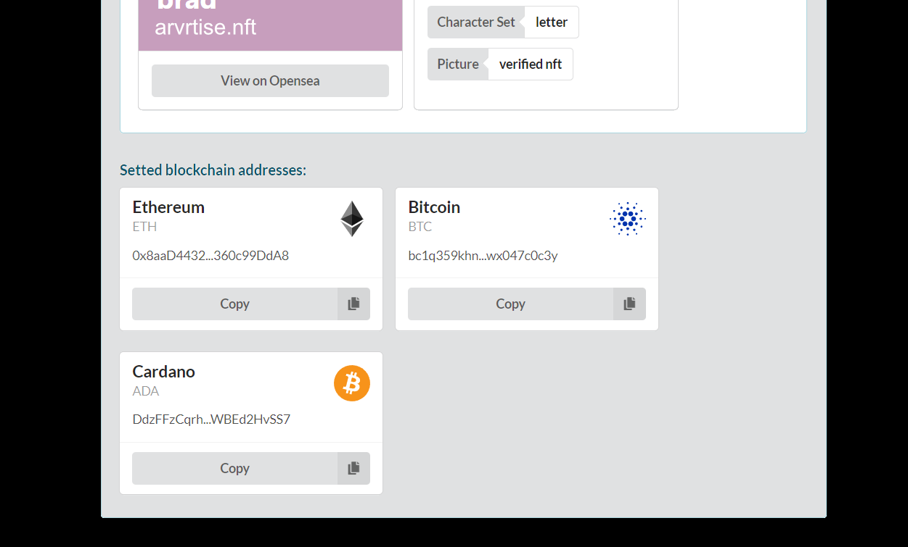

# ARVRtise Domain Verification

This dApp integrates "Unstoppable Resolution API" feature for getting information about domains (registered on Ethereum Mainnet or Polygon Mainnet).

Domain metadata (like owner, image and more) is retrieved by calling ProxyReader Contracts methods.

```
ProxyReader provides an interface that allows to fetch information about 
domains from both UNSRegistry and CNS smart contracts in one call.
```

* Site demo https://verify.arvrtise.com

## dApp created using:

- ReactJs
- Semantic UI React
- Ethers

## Build dApp instructions

Install dependencies :
```
npm install
```

Start app :
```
npm start
```



